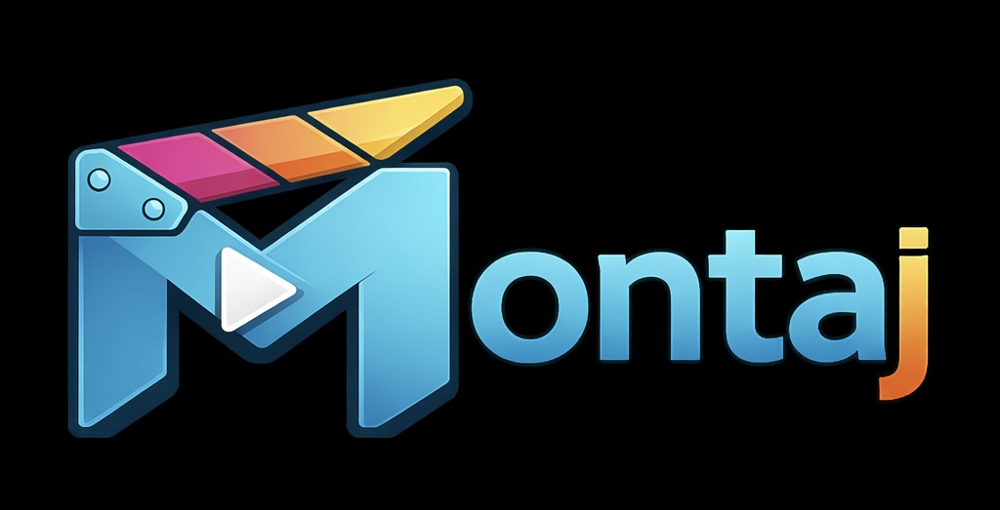

<p align="center">
  
</p>

# Montaj

> A video editing CLIP for AI agents. CLI-first, agent-native, open source.

Montaj is a **CLIP** — a CLI Program for agents. It clips onto your existing AI agent (Claude Code, OpenClaw, Cursor, or any harness) and gives it the specialized tools to edit video. Built-in steps cover the full editing pipeline. The agent decides what to run, in what order, and with what parameters.

**The fundamental dependency is an agent.** Montaj doesn't edit on its own. It provides the tools; the agent makes the creative decisions.

## Quick install
Send this to your agent:
```
Install Montaj from https://github.com/theSamPadilla/montaj, then read skills/onboarding/SKILL.md to get us started.
```

## Manual Install

**macOS** (installs ffmpeg, whisper-cpp, Node.js, and all Python deps):
```bash
brew install theSamPadilla/montaj/montaj
```

**Linux / manual:**
```bash
git clone https://github.com/theSamPadilla/montaj
cd montaj
pip install -e .
# then install ffmpeg, whisper-cpp, and Node.js >=18 separately
```

## Quick Start

```bash
# Headless — agent edits, renders, done
montaj run ./clips --prompt "tight cuts, remove filler, 9:16"

# With UI — watch the agent work live, tweak the result
montaj serve
```

## What's Inside

```
steps/              Step executables + JSON schemas (probe, trim, transcribe, etc.)
workflows/          Suggested editing plans (overlays.json, tight-reel.json, etc.)

render/             React + Puppeteer + ffmpeg render engine
serve/              Local HTTP + SSE server (montaj serve)
ui/                 Browser UI (Vite + React + Tailwind)
docs/               Architecture, CLI reference, UI design, schemas
```

## How It Works

```
1. Upload clips + write an editing prompt
2. montaj creates project.json [pending]
3. Agent picks it up, reads the workflow, calls steps as tools
4. Agent writes project.json as it works → UI updates live via SSE
5. Agent marks project [draft]
6. Human reviews in browser (optional) → tweaks → marks [final]
7. Render engine → final MP4
```

See [docs/ARCHITECTURE.md](docs/ARCHITECTURE.md).

## CLI

Every operation is available from the terminal. `montaj` is the full command, `mtj` is the short alias.

```bash
montaj run ./clips --prompt "tight cuts, upbeat pacing"
montaj serve
montaj render
montaj fetch https://youtube.com/watch?v=...
```

See [docs/CLI.md](docs/CLI.md) for the full reference.

## Steps & Workflows

**Steps** are the individual editing operations — Python executables with JSON schemas, callable as agent tools, CLI commands, or API calls. Native steps ship with Montaj; custom steps are any executable that follows the output convention.

| Category | Steps |
|----------|-------|
| **Inspect** | `probe`, `snapshot` |
| **Clean** | `waveform_trim`, `rm_fillers`, `rm_nonspeech` |
| **Edit** | `trim`, `concat`, `materialize_cut`, `resize`, `extract_audio` |
| **Enrich** | `transcribe`, `caption`, `normalize` |
| **VFX** | `remove_bg` — background removal via RVM |
| **Acquire** | `fetch` — download from any URL via yt-dlp |

**Workflows** are suggested editing plans — which steps to use and with what default params. The agent reads the plan, reads the prompt, and decides the actual execution. Available workflows: `clean_cut`, `overlays`, `short_captions`, `animations`, `explainer`, `floating_head`.

Custom steps and workflows are discovered automatically — no registration needed. See [docs/ARCHITECTURE.md](docs/ARCHITECTURE.md) for details.

## Render Engine

React + Puppeteer + ffmpeg. Reads `project.json [final]`, renders captions and overlays frame-by-frame via headless Chrome, composites with source footage via ffmpeg → final MP4.

See [docs/RENDER.md](docs/RENDER.md) for the full breakdown.

## UI

Optional browser interface. Upload → watch the agent work live → review → render.

```bash
montaj serve   # http://localhost:3000
```

- **Editor** — timeline, preview player, caption editor, overlay editor
- **Workflows** — n8n-style node graph for building editing plans
- **Overlays** — live animated preview of custom JSX overlays
- **Profiles** — view creator style profiles (pacing, color palette, editorial direction)

The UI is a layer on top of the CLI, not a separate system. Every action maps to a CLI command.

## Project JSON

The single format that flows through the entire pipeline. One file, three states:

| State | Who writes | Contents |
|-------|-----------|----------|
| `pending` | `montaj serve` / `montaj run` | Clip paths, prompt, workflow name |
| `draft` | Agent | Trim points, ordering, captions, overlays — complete edit |
| `final` | Human (via UI) | Reviewed and tweaked, ready to render |

See [docs/schemas/project.md](docs/schemas/project.md) for the full schema.


## Dependencies

`pip install montaj` handles Python dependencies automatically. Two system tools require separate installation — they are compiled binaries that can't be bundled in a Python package.

**Included via pip:**

| Package | Purpose |
|---------|---------|
| `Pillow` | Image processing (color analysis, frame sampling) |
| `yt-dlp` | Video download from TikTok, Instagram, YouTube, etc. |

**Required system dependencies:**

| Tool | macOS | Linux | Windows |
|------|-------|-------|---------|
| `ffmpeg` + `ffprobe` | `brew install ffmpeg` | `apt install ffmpeg` | [ffmpeg.org](https://ffmpeg.org/download.html) |
| `whisper-cpp` | `brew install whisper-cpp` | build from source | build from source |

**Required for the render engine and UI:**

| Tool | Install |
|------|---------|
| `Node.js >=18` | `brew install node` / [nodejs.org](https://nodejs.org) |

`brew install theSamPadilla/montaj/montaj` handles all of the above on macOS in one command.

## Why Montaj Exists

A video editing skill tells an agent how to think about editing. An MCP tool lets an agent cut a clip at a timestamp. Montaj is neither — it's a CLIP.

An agent with Montaj can probe a clip for metadata, transcribe it, identify filler words and silence gaps, pick the best takes, trim out the bad ones with battle-tested ffmpeg operations that handle codec edge cases correctly, and composite the result — all by following an opinionated workflow that encodes domain expertise. All while using a fraction of the tokens an agent would burn building the same pipeline from scratch.

Other programmatic video tools (Remotion, etc.) give an agent a framework to **write code** — the agent authors JSX compositions that describe a video.

While Montaj also supports custom JSX compositions for animation generation, it focuses primarily on **existing footage**. Cliping, picking best takes, tuning editing to a given content style, etc. It gives the agent **orchestration tools** to work, and gives humans a **UI for last mile reviews**. 

The building blocks:

- **Agent-native interface** — CLI, HTTP, and MCP; steps are callable from any harness without writing code
- **Editing existing footage** — trim, cut, transcribe, composite against source clips
- **Animation generation** — agent can generate React overlay components (captions, titles, effects) rendered frame-by-frame via headless Chrome and composited in
- **Local-first** — ffmpeg + whisper.cpp, no external APIs required, just an agent
- **Open source** — MIT, self-hosted, no vendor

## Docs

- [Architecture](docs/ARCHITECTURE.md) — how everything fits together
- [CLI Reference](docs/CLI.md) — full command list
- [UI Design](docs/UI.md) — browser interface
- [Project JSON Schema](docs/schemas/project.md) — the core format
- [Overlay Contract](docs/schemas/overlay.md) — render component spec


## License

MIT — do whatever you want. See [LICENSE](LICENSE).
